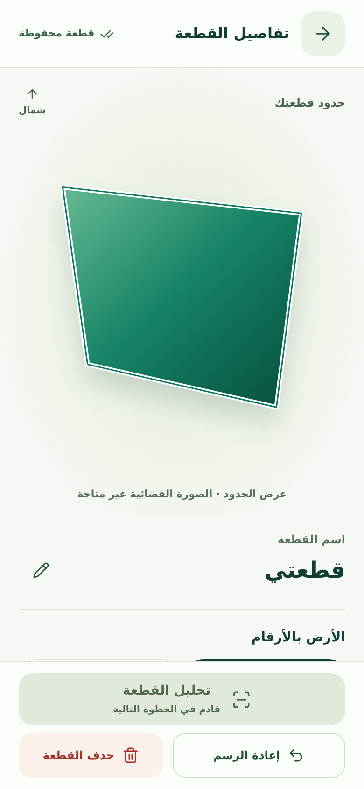
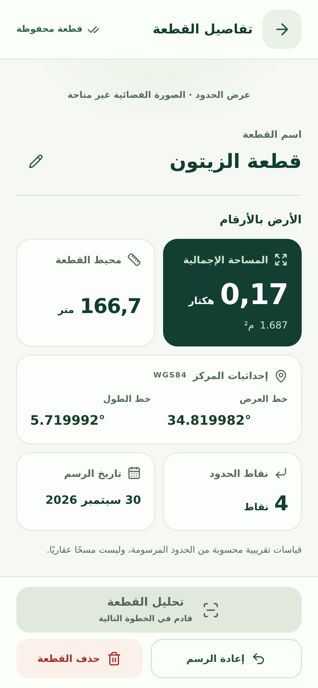
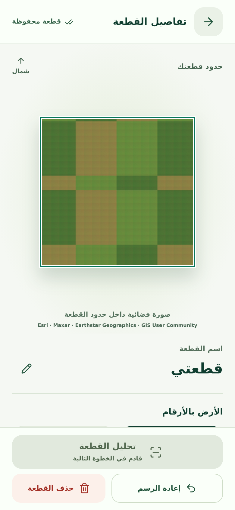
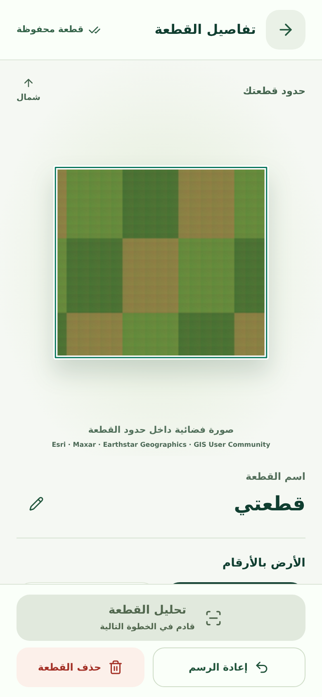
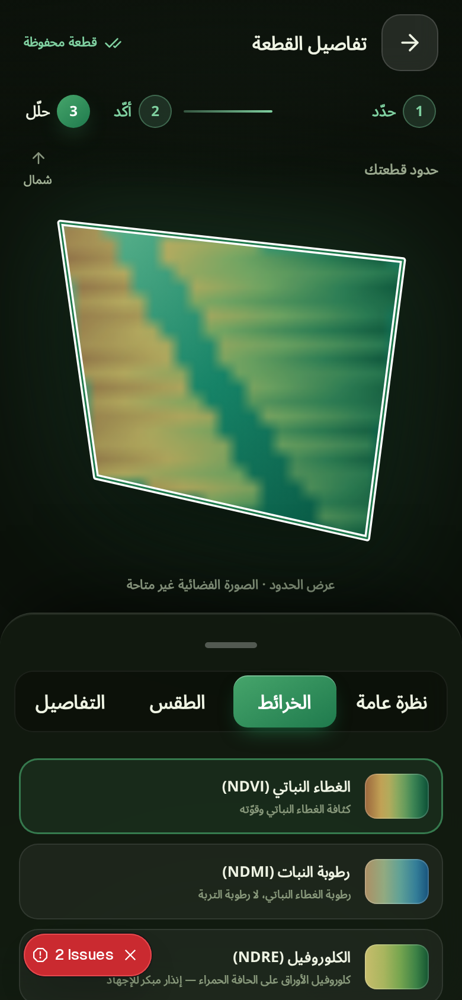
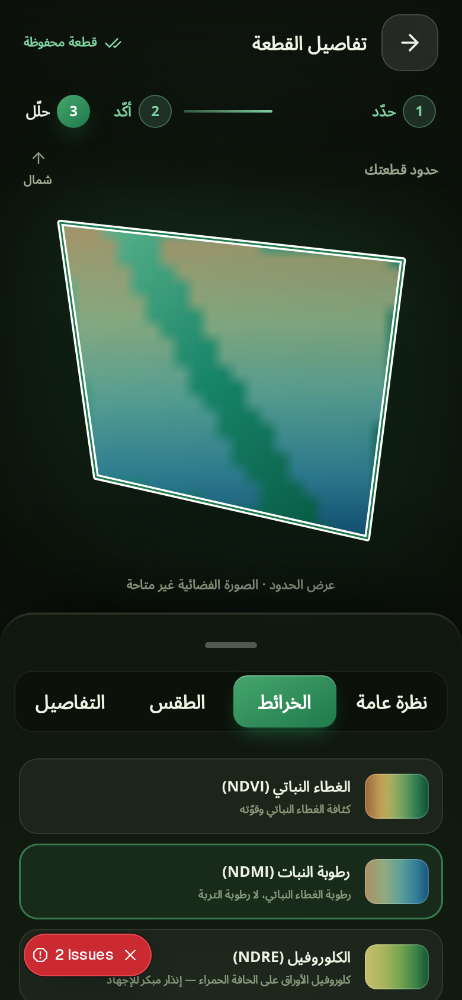
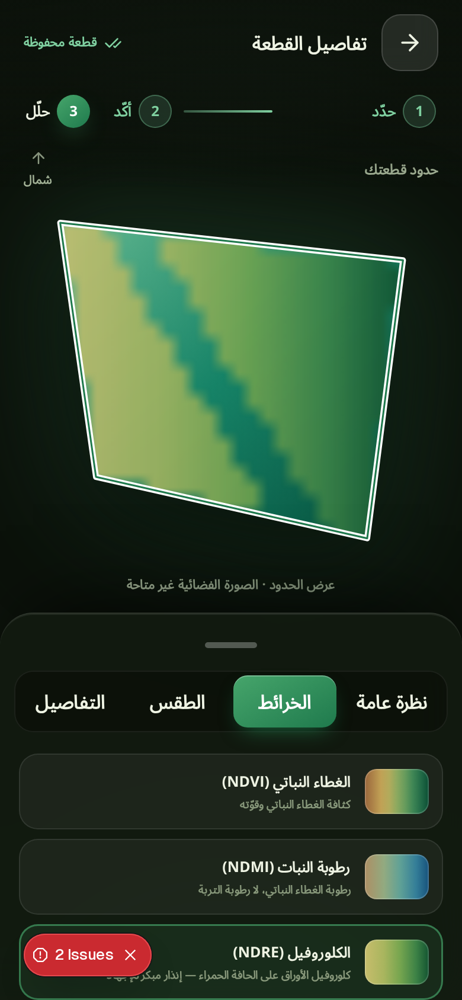
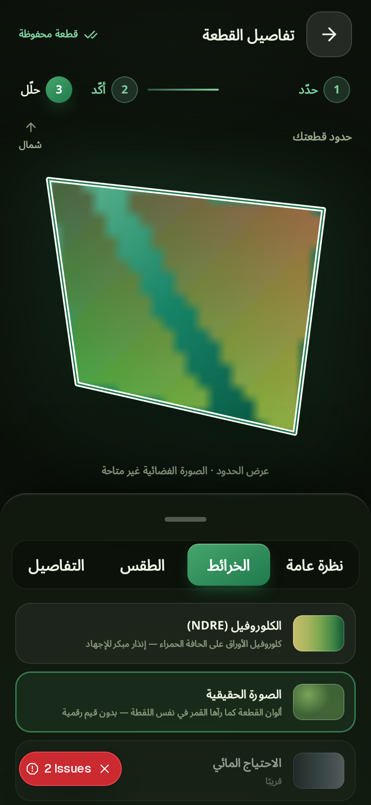

# Stage 1 · Full-screen plot view

## Delivered

- Finishing a valid drawing with **تم** uses the existing `onSave → addPlot → savePlot` flow, then opens an opaque full-screen plot view. Failed validation/save stays on the drawing screen, with the draft and a retry action. Concurrent saves are guarded.
- Back returns to the still-mounted drawing map. Redraw starts its existing drawing handler and replaces the same active plot on the next save. Saved-plot chips also reopen the view. Delete asks for confirmation.
- No live map, controls, blurred map, or dim isolation layer inside the new screen. This base checkout did not contain `plotIsolate`.
- North-up SVG polygon, uniformly fitted using Web Mercator coordinates. Its proportions match the drawing map; its canvas-composited texture is clipped to the exact boundary. Small plots are enlarged instead of becoming tiny map features.
- Esri coverage metadata skips unavailable levels. Each tile starts at the resolution needed for the 1024px texture (up to z23) and walks to its genuine parent independently. `blankTile=false`, HTTP/decode checks, dimensions and conservative pixel validation reject gray/text/transparent placeholders. Parent source crops preserve geographic alignment, rather than repeating or stretching a whole parent tile into each child.
- Six concurrent workers, shared parent requests, 36 target tiles maximum, 100 total requests, 12-second overall budget. Up to eight ancestor levels. The texture publishes only when the complete mosaic succeeds. Otherwise the polygon retains its emerald gradient. Attribution is displayed for imagery.
- Inline name editing uses existing metadata-only `renamePlot`; area (ha and m²), spherical perimeter, WGS84 centroid, unique vertex count and original creation date derive from the saved geometry/record. Measurements are labelled approximate.
- Arabic RTL and French LTR copy. All plot-view buttons are at least 48px. Disabled **تحليل القطعة** explicitly says **قادم في الخطوة التالية**. No analysis action added.
- Fade/scale entry/exit, reduced-motion support, focus containment/restoration, inert background, labelled editing controls and delete confirmation, safe-area padding, independently scrollable information.

## Narrow persistence fix

The existing store saved locally before awaiting Firestore, but its write promise could remain pending indefinitely offline. That blocked the required post-save navigation, rename and deletion. These existing operations now cap the **remote acknowledgement** at four seconds without cancelling the queued SDK write. Local persistence remains the same. Rename prefers the current local record and writes name/timestamp metadata only.

`useFieldData` changes only the `addPlot` return type/value to return the persisted `Plot` alongside `ok`; observation requests, cache invalidation and satellite behaviour are unchanged. Dashboard components/cards, assistant, search, geocoder, satellite API/pipeline, `FieldMapCanvas.tsx`, and `map.css` were **not modified**.

The current `/api/geocode` only implements forward search, not reverse lookup. The optional commune/wilaya label was skipped, as allowed, rather than modifying search or inventing a location.

## Browser evidence · 2026-09-30

Tested the production build in actual Chromium with **390×844 mobile viewport, touch enabled, device scale 2**. Drawing uses real Leaflet pointer events; Done and plot actions use touch taps. Additional screenshots at **320×740** and **1280×900** verify responsive layout. This is browser mobile emulation, not a physical-device test.

- `npm run build`: passed.
- `npx tsc --noEmit`: passed.
- `npm run test:unit`: **420 passed** (including 7 new plot-view geometry/imagery tests).
- `npm run lint`: no errors; one existing unused `onChip` warning in untouched `AssistantView.tsx`.
- Mobile browser suites: **16 passed** across plot view (5), existing field map (4), and existing map search (7).
- Verified: save once, persisted rename with unchanged ID/ring/date, back and saved-plot reopen, redraw replacing the same ID, cancel/confirm deletion, deleted state after reload, 48px controls, hidden background map, focus trap, Escape/back, reduced motion, incomplete drawing not saved.
- Geometry cases: irregular **0.17 ha**, rectangular **0.17 ha** and **40.01 ha** in the browser; narrow/concave boundaries and exact 40 ha in pure geometry tests.
- Imagery cases: failed requests, HTTP-200 gray text placeholders, metadata reporting missing zooms, mixed child/parent coverage, malformed image bodies. Highest accepted zoom and fallback state are asserted, not just screenshot-tested.

### Important evidence limits

Live Esri TLS requests are blocked in this sandbox. Therefore live imagery quality/coverage has **not** been verified here. `fixture` screenshots use intentionally synthetic textured tiles intercepted **only in Playwright** to test compositing, correct parent cropping and SVG clipping. These are **not real satellite photographs**. Production code always requests Esri; no synthetic fixture is shipped to the app.

Firestore and the field observation upstream are also unavailable here. Browser verification establishes local-first persistence, not successful cloud acknowledgement; `/api/field-data` is stubbed for these UI tests. No claim of a completed satellite analysis is made.

## Screenshots

### Actual unavailable-imagery state, irregular 0.17 ha

| Full-screen plot | Scrolled details and persisted edited name |
| --- | --- |
|  |  |

### Deterministic imagery fixtures, not satellite photographs

| Small plot, 0.17 ha | Large plot, 40.01 ha |
| --- | --- |
|  |  |

- [320px small plot](04-small-fixture-320.png)
- [320px large plot](04-large-fixture-320.png)
- [Desktop small plot](05-small-fixture-desktop.png)
- [Desktop large plot](05-large-fixture-desktop.png)

## Files changed

Existing:
- `src/components/map/FieldMapSheet.tsx`: save/transition integration, back/redraw/reopen.
- `src/lib/field-data/useFieldData.ts`: return the saved plot record.
- `src/lib/field-data/plots.ts`: bounded remote acknowledgements and metadata rename.

New:
- `src/components/plot/PlotView.tsx`
- `src/components/plot/plot-view.css`
- `src/lib/plot/geometry.ts`
- `src/lib/plot/imagery.ts`
- `test/unit/plot-view.unit.test.ts`
- `e2e/plot-view.spec.ts`
- `docs/plot-view/README.md` and eight screenshots.

## Reproduce

Run a production server on port 3000, then:

```sh
npm ci
npm run build
npm run start -- --hostname 0.0.0.0
# In another terminal, after installing Playwright Chromium if needed:
npx playwright test e2e/plot-view.spec.ts e2e/field-map.spec.ts e2e/map-search.spec.ts --project='Mobile Chrome' --workers=1
```

The Playwright config also supports `PW_CHROMIUM_PATH` for a preinstalled browser. This sandbox used the installed `@sparticuz/chromium` binary plus its bundled AL2023 libraries (`LD_LIBRARY_PATH=/tmp/al2023/lib:/tmp`); no browser binaries or dependencies were added to Git.

## Stage 2 · Lazy satellite layers (NDMI, NDRE, true colour)

### Delivered

- **Same request pattern as NDVI.** New Sentinel-2 layers reuse the existing
  Process-API flow (`fetchSceneRaster`): same polygon, same 10 m grid, same
  scene (the NDVI scene's own `YYYY-MM-DD`, `leastCC`), same `CDSE_CLIENT_ID`
  / `CDSE_CLIENT_SECRET`, same traced steps (`cdse-token`, `sh-catalog`,
  `sh-process`). NDMI `(B8A−B11)/(B8A+B11)` and NDRE `(B8A−B05)/(B8A+B05)` set
  `processing.upsampling: "BILINEAR"` because B11/B05 are 20 m bands; the
  request states `20 م مُعاد أخذ العينات` in the UI. True colour (B04,B03,B02)
  is an image layer with no index values and no resampling block. NDVI's own
  evalscript, request body and numbers are byte-identical to before
  (`buildIndexEvalscript("B08","B04","NDVI") === EVALSCRIPT`, unit-tested).
- **Lazy by construction.** `/api/field-data` still returns NDVI only. NDMI,
  NDRE and true colour are requested the FIRST time their chip is selected,
  through the stateless `/api/field-data/layer` route (no Firestore, no daily
  cache). `layer-fetch.ts` memoises one raster per plot + scene + layer in
  memory, deduplicates in-flight asks, never caches failures, and supersedes a
  stale scene. Shimmer while loading, per-layer error card + retry.
- **The الخرائط tab** lists NDVI, NDMI, NDRE, الصورة الحقيقية selectable with
  fixed ramps and legends showing each layer's REAL min/max; values are
  unit-free (`بدون وحدة`). Overview stats and the tap-a-pixel probe follow the
  selected layer; masked pixels (`dataMask` 0) stay transparent everywhere —
  no estimated values. «الاحتياج المائي» and «الإجهاد الحراري» remain locked
  «قريباً». Radar (Sentinel-1) is out of scope.
- **Layout fixes.** Tab content scrolls inside its own container below the
  segmented control; the التفاصيل tab is now one row-card per record (label
  right, value left, aligned).

### Verification

- `npx tsc --noEmit`, `npm run lint` (0 errors), `npm run test:unit`
  **484 passed** (16 new layer tests: formulas executed from the shipped
  evalscripts, band lists + FLOAT32, dataMask/SCL parity with NDVI, request
  pattern equality, cache keys, lazy memo/retry/supersede, config copy).
- `npm run build` passes.
- e2e `e2e/plot-layers.spec.ts` (4 tests) passes in real Chromium with the
  field-data routes mocked on ONE synthetic scene: asserts zero layer requests
  before the first chip tap, one request per layer on the NDVI scene date,
  local caching, per-layer retry, locked chips; captures the screenshots
  below.

### Browser evidence · 2026-10-01

Real Chromium (the `@sparticuz/chromium` binary with its bundled AL2023 libs
and a Noto Sans Arabic TTF for glyphs), 390×844 mobile emulation with touch,
plus 360px and 430px RTL captures. Synthetic scene: 24×22 grid @10 m with a
diagonal cloud band masked on every layer — the band reads as "no data"
(base shows through) in all four layers.

| NDVI | NDMI |
| --- | --- |
|  |  |
| **NDRE** | **True colour** |
|  |  |

- [NDMI at 360px](layer-ndmi-360.png) · [NDMI at 430px](layer-ndmi-430.png)
- `preview-layer-*.png` are pixel-exact renders of the composed overlays
  (production compose code, same fixtures) produced by
  `tools/render-layer-previews.mts` — useful without a browser.

### Files changed

Existing: `src/lib/satellite/sentinelhub.ts`, `src/lib/plot/ndvi-layers.ts`,
`src/lib/field-data/types.ts`, `src/components/plot/PlotView.tsx`,
`src/components/plot/PlotAnalysisPanel.tsx`,
`src/components/plot/plot-view.css`, `docs/plot-view/README.md`.

New: `src/app/api/field-data/layer/route.ts` (stateless layer route — the one
route addition; `/api/field-data` and its Firestore cache untouched),
`src/lib/plot/layer-fetch.ts`, `test/unit/satellite-layers.unit.test.ts`,
`e2e/plot-layers.spec.ts`, `tools/render-layer-previews.mts`, screenshots.

Assistant/PhytoScan, Firestore code, env vars, package.json, globals.css,
settings/account screens and all pre-existing tests are untouched.
